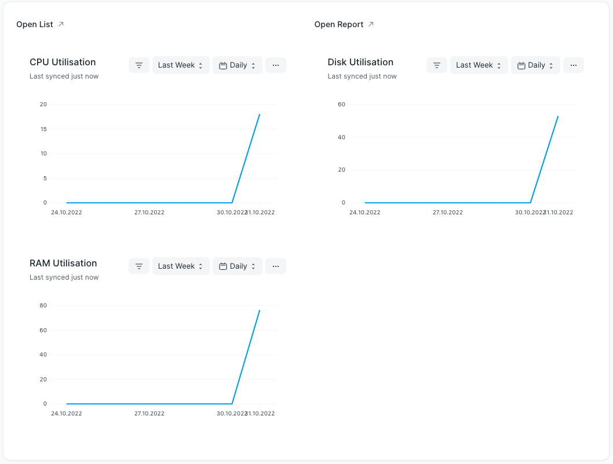
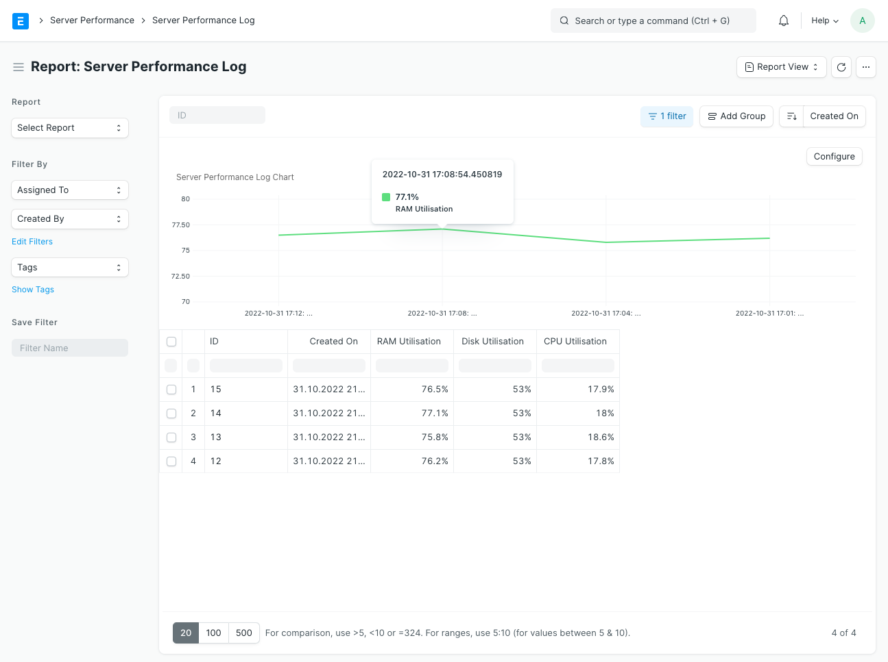

## Server Performance

Monitor the performance of the server running your frappe site.

Inspired by https://github.com/mymi14s/frappe_system_monitor, but implemented as a log DocType rather than as a custom page.

#### Workspace

Currently, the lowest resolution supported by these charts is one day. That's why they show average values for every day. Admittedly, this is not very useful for CPU and RAM. Hopefully we'll get higher resolutions (hour, minute) in the future. If you want to see more detailed data, go to the list or report view.

#### List View

#### Report View

To recreate:

1. Add column "Created On"
2. Click "..." > "Add Chart"
3. Select "Created On" as "X Axis Field"
4. Select "CPU Utilisation" as "Y Axis Fields"
5. Select "Line" as "Chart Type"
6. Click "Submit"
